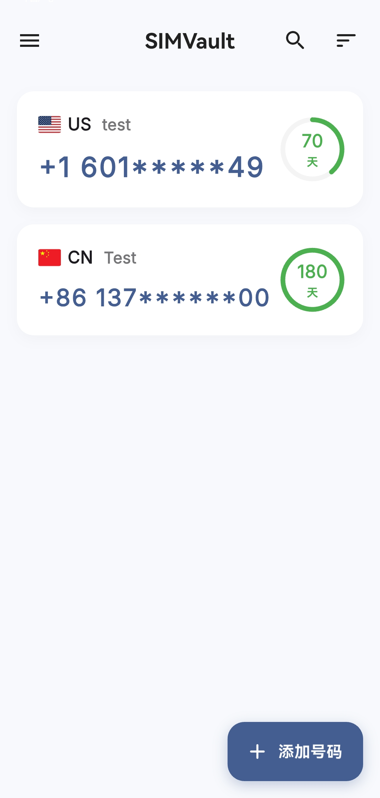

<div align="center">
  
  
  <h1>SIMVault</h1>
  
  <p>
    <b>一个现代、极美、且极度可靠的手机卡保号追踪与提醒工具</b>
  </p>
  
  <p>
    <a href="README_en.md">English</a> | <b>简体中文</b>
  </p>
  
  <p>
    
    
    
  </p>
</div>

---

## 📖 简介

在拥有多张海外实体手机卡、境外流量卡或各类保号卡的今天，忘记充值或续期导致号码被注销是令人极其头疼的问题。**SIMVault** 应运而生。

SIMVault 是一款采用 Flutter 打造的现代跨平台应用，它不仅拥有**极其流畅和令人惊艳的 UI 设计**，更在底层搭载了**极客级的后台守护架构**。哪怕在杀后台极为严苛的定制安卓系统上，它也能穿透层层阻碍，确保在号码到期前将通知准确送达。

## ✨ 核心特性

- 🎨 **惊艳的动态 UI**：毛玻璃（Glassmorphism）、微动画、丝滑卡片展开以及多种内置唯美渐变主题，给你顶级的视觉与交互体验。
- 🛡️ **极客级保活架构**：
  - **前台守护进程**：常驻底层，防清理、防强杀，数秒内浴火重生。
  - **原生闹钟级调度**：使用 `AlarmClock` 顶级特权唤醒休眠设备。
  - **全屏意图轰炸 (FullScreenIntent)**：最高级别打扰权限，锁屏状态强行点亮屏幕。
  - **WAKE_LOCK & 极速自启**：黑屏深度休眠期间强制唤醒 CPU，系统重启后无需解锁即可接管闹钟。
- ☁️ **WebDAV 云端同步**：内置极简 WebDAV 同步引擎（完美支持坚果云等），一键云端备份，换机数据永不丢失。
- 🔒 **隐私与安全**：支持通过指纹/面容/密码锁定应用，保护你的卡号隐私。
- 🌍 **多语言支持**：原生支持简体中文与英语，并支持随系统自动切换。

## 📸 界面预览

<div align="center">
  
</div>

## 🚀 安装指南

### 直接下载安装

前往 [Releases](../../releases) 页面下载最新版的 `app-release.apk`。

### 源码编译

请确保你的开发环境已安装 [Flutter SDK](https://flutter.dev/docs/get-started/install) (建议版本 3.22.0 或以上)。

```bash
# 1. 克隆仓库
git clone https://github.com/your-username/SIMVault.git

# 2. 进入目录
cd SIMVault

# 3. 安装依赖
flutter pub get

# 4. 运行应用
flutter run

# 5. 打包 Release APK
flutter build apk --release
```

## 🛠️ 极致保活配置指北

为了在部分杀后台严重的安卓 ROM（如 HarmonyOS、MIUI、ColorOS 等）上实现 **100% 的通知送达率**，除软件底层的**前台守护进程**外，建议用户配合以下操作：

1. **后台多任务加锁**：在最近任务列表，将 SIMVault 下拉加锁。
2. **电池优化白名单**：前往系统的“应用启动管理”，关闭 SIMVault 的自动管理，并允许：
   - 允许自启动
   - 允许关联启动
   - 允许后台活动

*(详见 APP 侧边栏的「通知保活设置」中心)*

## 🤝 参与贡献

我们欢迎任何形式的贡献，包括但不限于：

- 提交 Bug 反馈与建议 (Issues)
- 改进代码或提交新特性 (Pull Requests)
- 帮助完善多语言翻译
- 优化 UI/UX 设计

在提交 PR 之前，请确保代码通过了基本的 lint 检查：`flutter analyze`。

## 📄 开源协议

本项目基于 **MIT License** 开源。详情请参阅 [LICENSE](LICENSE) 文件。
