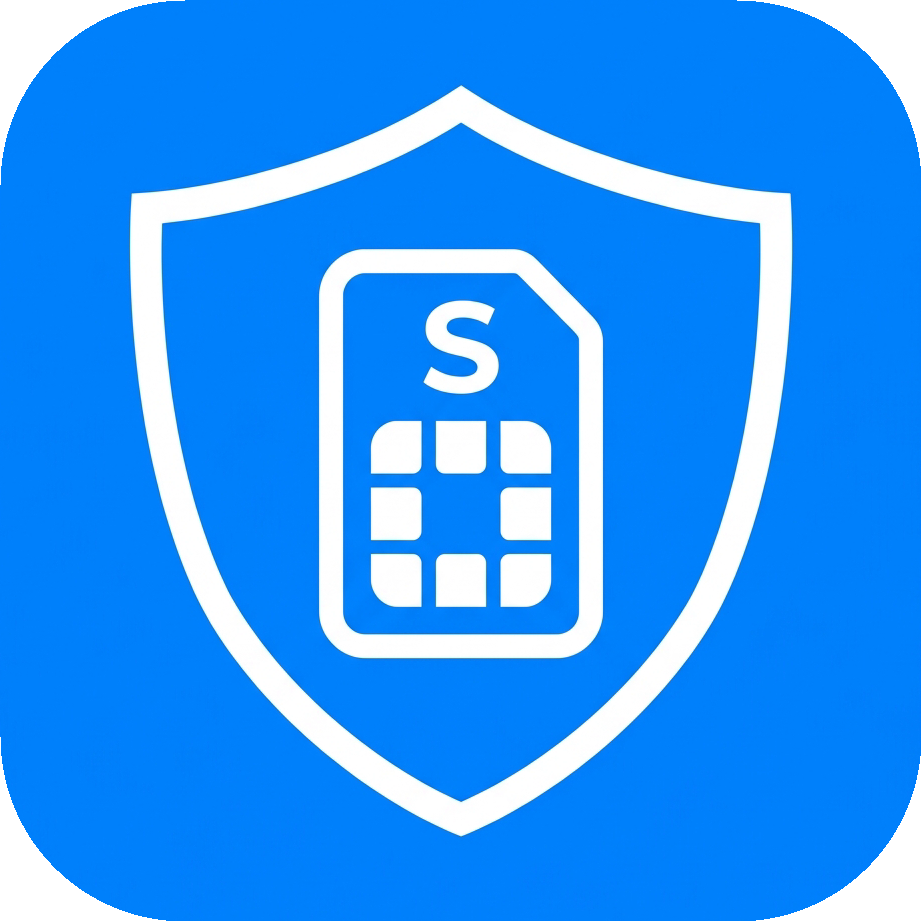
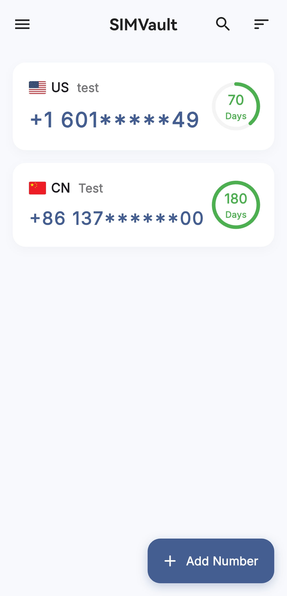

<div align="center">
  
  
  <h1>SIMVault</h1>
  
  <p>
    <b>A Modern, Beautiful, and Extremely Reliable SIM Card Expiration Tracker</b>
  </p>
  
  <p>
    <b>English</b> | <a href="README.md">简体中文</a>
  </p>
  
  <p>
    
    
    
  </p>
</div>

---

## 📖 Introduction

In today's world of multiple international physical SIM cards, travel data cards, and number-parking SIMs, forgetting to top-up and losing your number is a massive headache. **SIMVault** is here to fix that.

SIMVault is a modern cross-platform application built with Flutter. Not only does it boast **an incredibly smooth and stunning UI design**, but it is also powered by an **extreme geek-level background daemon architecture**. Even on heavily customized Android ROMs known for aggressively killing background tasks, SIMVault penetrates the restrictions to ensure your expiration notifications are delivered accurately and on time.

## ✨ Core Features

- 🎨 **Stunning Dynamic UI**: Glassmorphism, micro-animations, silky smooth card expansions, and multiple gorgeous built-in gradient themes provide a premium visual and interactive experience.
- 🛡️ **Extreme Keep-Alive Architecture**:
  - **Foreground Daemon**: A persistent underlying service that resists system cleanups and auto-revives within seconds if force-killed.
  - **Native AlarmClock Scheduling**: Utilizes the highest-privilege `AlarmClock` API to wake up deeply sleeping devices.
  - **Full Screen Intents**: Deploys maximum-priority interruption permissions to force the screen on even when locked.
  - **WAKE_LOCK & DirectBootAware**: Forces the CPU awake during deep black-screen sleep and automatically takes over alarms upon device reboot without requiring an unlock.
- ☁️ **WebDAV Cloud Sync**: A minimalist built-in WebDAV synchronization engine. Back up to the cloud with one click so your data is never lost when switching devices.
- 🔒 **Privacy & Security**: Secure your card numbers and data by locking the app with your device's biometric authentication (Fingerprint/Face ID) or PIN.
- 🌍 **Multi-Language Support**: Natively supports English and Simplified Chinese, switching automatically based on your system locale.

## 📸 Screenshots

<div align="center">
  
</div>

## 🚀 Installation

### Download

Go to the [Releases](../../releases) page and download the latest `app-release.apk`.

### Build from Source

Ensure you have the [Flutter SDK](https://flutter.dev/docs/get-started/install) installed (version 3.22.0 or higher recommended).

```bash
# 1. Clone the repository
git clone https://github.com/your-username/SIMVault.git

# 2. Enter directory
cd SIMVault

# 3. Get dependencies
flutter pub get

# 4. Run the app
flutter run

# 5. Build Release APK
flutter build apk --release
```

## 🛠️ Ultimate Keep-Alive Configuration

To achieve a **100% notification delivery rate** on Android ROMs notorious for killing background apps, users are recommended to complement the built-in **Foreground Daemon** with the following manual steps:

1. **Lock in Recent Tasks**: Swipe down on the SIMVault card in your recent tasks view to lock it.
2. **Battery Optimization Whitelist**: Go to your system's "App Launch" or "Battery" settings, disable "Manage automatically" for SIMVault, and allow:
   - Auto-launch
   - Secondary launch
   - Run in background

*(See the "Keep-Alive Settings" in the app's sidebar for details)*

## 🤝 Contributing

Contributions of any kind are welcome!

- Submit bug reports and feature requests via Issues.
- Improve code or add new features via Pull Requests.
- Help refine multi-language translations.
- Optimize UI/UX design.

Before submitting a PR, please ensure your code passes basic lint checks: `flutter analyze`.

## 📄 License

This project is licensed under the **MIT License**. See the [LICENSE](LICENSE) file for details.
